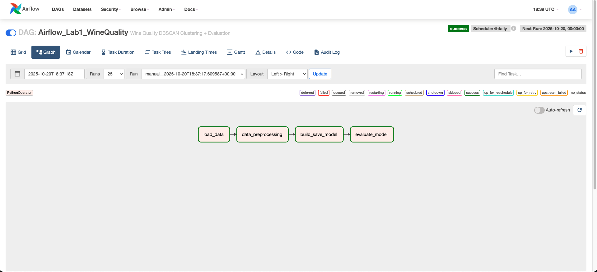
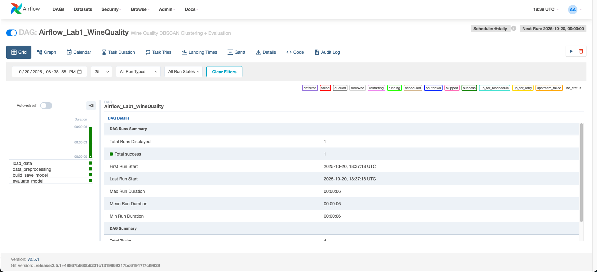

# MlOps_Airflow

# Airflow Lab 1 – Wine Quality Clustering (DBSCAN)

This project implements an **Apache Airflow pipeline** for automating an end-to-end **data processing and unsupervised machine learning workflow**.
The DAG performs **ETL, preprocessing, DBSCAN clustering, and model evaluation** on the **Wine Quality dataset** using Airflow’s task orchestration capabilities.

---

## 🎯 Objective

To build a modular, automated pipeline in Airflow that:

1. Loads and cleans the **Wine Quality dataset**
2. Scales and prepares features for clustering
3. Builds and saves a **DBSCAN clustering model**
4. Evaluates model quality using the **Silhouette Score**

---

## ⚙️ Airflow DAG Overview

The DAG is named **`Airflow_Lab1_WineQuality`** and includes the following tasks:

| Task                   | Description                                                      | Output                      |
| ---------------------- | ---------------------------------------------------------------- | --------------------------- |
| **load_data**          | Loads the Wine Quality dataset and drops null values             | `processed_winequality.csv` |
| **data_preprocessing** | Scales all numerical features using `MinMaxScaler`               | `scaled_winequality.csv`    |
| **build_save_model**   | Builds a **DBSCAN** clustering model and saves it using `pickle` | `dbscan_model.pkl`          |
| **evaluate_model**     | Evaluates clustering quality using **Silhouette Score**          | Printed in logs             |

Each task runs as an **independent PythonOperator** inside Airflow.

---

## 🧠 ML Model Used – DBSCAN

* **Model:** Density-Based Spatial Clustering of Applications with Noise (DBSCAN)
* **Reason:** Unlike K-Means, DBSCAN doesn’t require specifying the number of clusters. It’s effective for irregular, non-spherical data distributions such as chemical measurements in wine quality.
* **Evaluation Metric:** Silhouette Score (higher = better cluster separation)

---

## 🧰 Prerequisites

Before running the project, ensure you have:

* Docker Desktop (≥ 4 GB memory allocated)
* Git
* Internet access to pull the Airflow image

Python libraries (installed inside the container):

```bash
pandas
scikit-learn
pickle
numpy
apache-airflow==2.5.1
```

---

## 🚀 Setup and Execution

### 1️⃣ Clone the Repository

```bash
git clone https://github.com/meenuviji/Mlops_Airflow_Lab3
cd MlOps_Airflow
```

### 2️⃣ Place Dataset

Move your dataset to:

```
dags/data/winequality-white.csv
```

### 3️⃣ Start Airflow in Docker

```bash
docker compose up -d
```

Wait until you see:

```bash
airflow-webserver | 127.0.0.1 - - "GET /health HTTP/1.1" 200 -
```

### 4️⃣ Access Airflow UI

Visit: [http://localhost:8080](http://localhost:8080)

Login:

```bash
Username: airflow
Password: airflow
```

### 5️⃣ Trigger the DAG

* Go to **DAGs → Airflow_Lab1_WineQuality**
* Turn it **ON**
* Click **Trigger DAG**
* Monitor progress under **Graph View**

When successful, all tasks will appear green ✅:

```
load_data → data_preprocessing → build_save_model → evaluate_model
```

---

## 📊 Output Files

After a successful DAG run:

| File                        | Location                   | Description          |
| --------------------------- | -------------------------- | -------------------- |
| `processed_winequality.csv` | `/opt/airflow/dags/data`   | Cleaned dataset      |
| `scaled_winequality.csv`    | `/opt/airflow/dags/data`   | Normalized dataset   |
| `dbscan_model.pkl`          | `/opt/airflow/dags/models` | Trained DBSCAN model |

Verify via Docker:

```bash
docker exec -it lab_1-airflow-webserver-1 bash
ls /opt/airflow/dags/data
ls /opt/airflow/dags/models
```

---

---
## 📸 Screenshots

### DAG Graph View


### Task Log View



---

* [Apache Airflow Documentation](https://airflow.apache.org/docs/)
* [Wine Quality Dataset – UCI Machine Learning Repository](https://archive.ics.uci.edu/ml/datasets/wine+quality)

---

Would you like me to generate the **exact folder + image structure commands** (so you can just copy-paste and push to GitHub correctly)?
